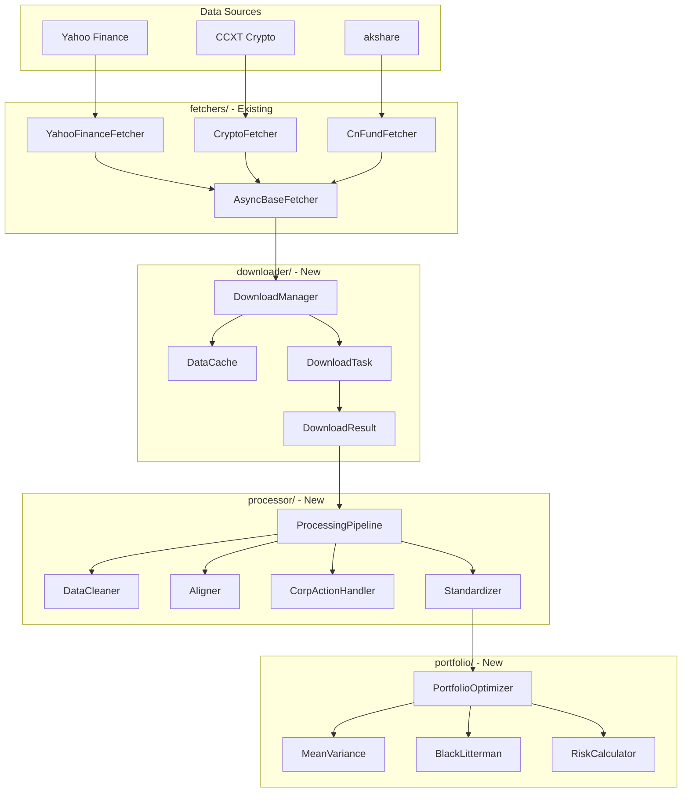
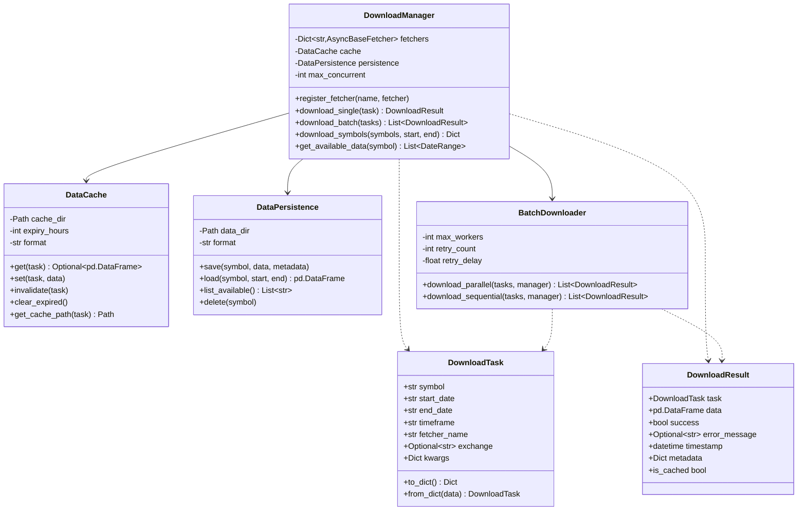
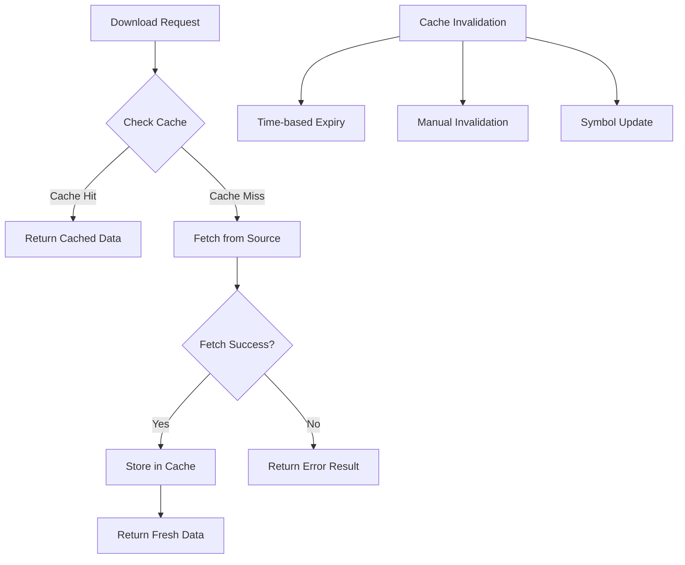
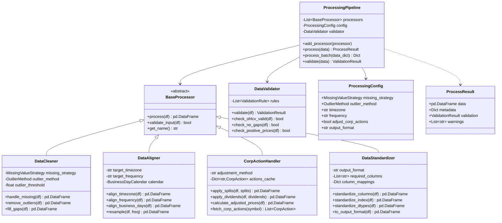
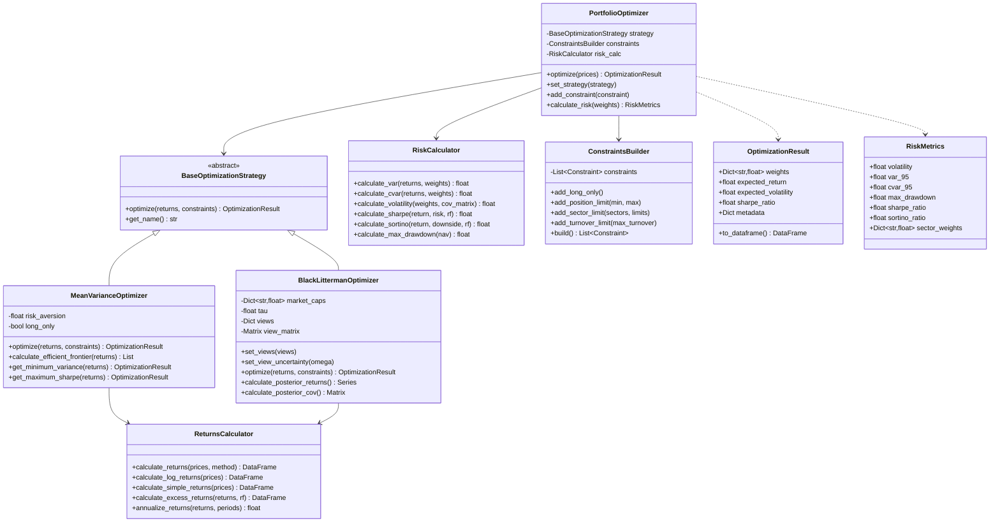
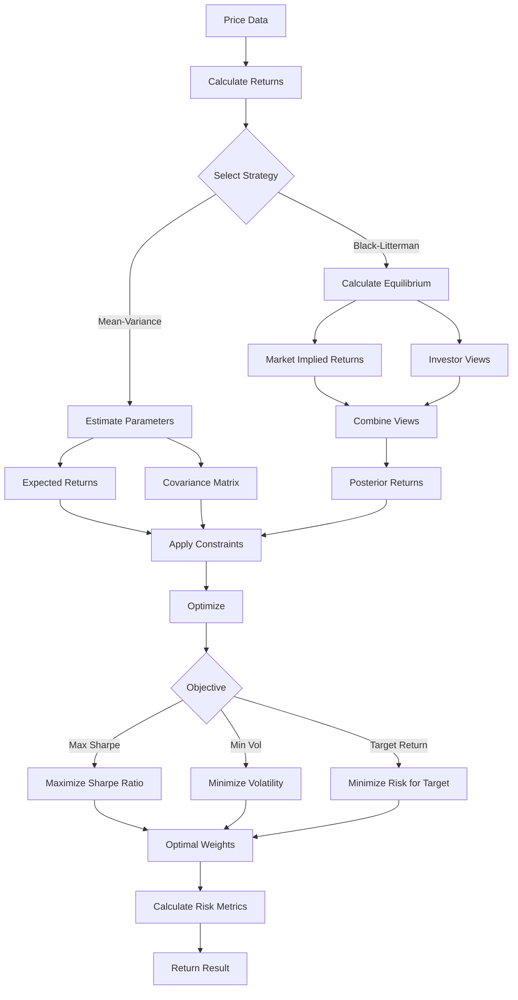
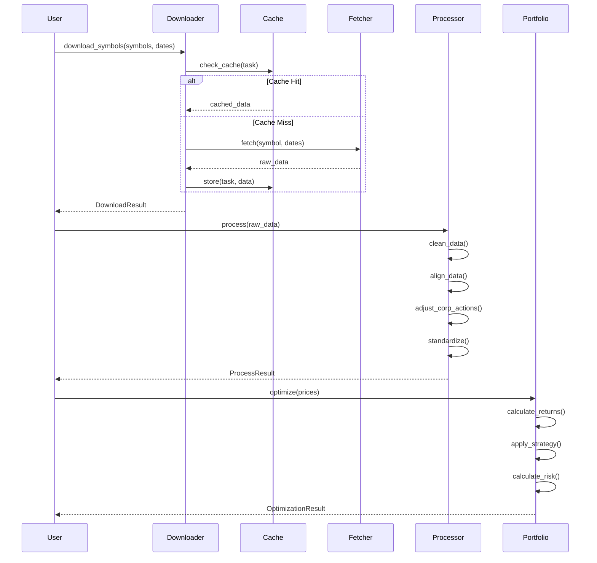
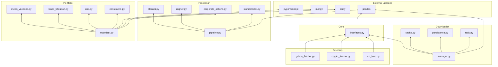

# NeoFM Module Architecture Design

## Executive Summary

This document outlines the architecture design for three new modules to extend the NeoFM financial data framework:

1. **Downloader Module** - Raw data download with batch processing and caching
2. **Processor Module** - Data cleaning, alignment, and standardization
3. **Portfolio Module** - Portfolio optimization using pyportfolioopt

---

## 1. Current Architecture Analysis

### 1.1 Existing Fetcher Interface

The current [`AsyncBaseFetcher`](fetchers/interfaces.py:9) defines the core contract:

```python
class AsyncBaseFetcher(ABC):
    @abstractmethod
    async def fetch(
        self, 
        symbol: str, 
        start_date: str, 
        end_date: str, 
        timeframe: str = '1d',
        exchange: Optional[str] = None,
        **kwargs
    ) -> pd.DataFrame:
        pass
```

### 1.2 Data Format Standard

All fetchers return DataFrames with:
- **Index**: `pd.DatetimeIndex` named `timestamp`
- **Columns**: `open`, `high`, `low`, `close`, `volume` (lowercase)

### 1.3 Existing Fetchers

| Fetcher | Data Source | Asset Types |
|---------|-------------|-------------|
| [`YahooFinanceFetcher`](fetchers/yahoo_fetcher.py:9) | yfinance | Stocks, ETFs, Forex, Futures |
| [`CryptoFetcher`](fetchers/crypto_fetcher.py:10) | CCXT | Cryptocurrency |
| [`CnFundFetcher`](fetchers/cn_fund.py:18) | akshare | Chinese Funds, ETFs, Money Funds |

---

## 2. Module Architecture Overview



---

## 3. Downloader Module Design

### 3.1 Module Structure

```
downloader/
├── __init__.py           # Module exports
├── manager.py            # DownloadManager - main orchestrator
├── cache.py              # DataCache - caching layer
├── task.py               # DownloadTask, DownloadResult - data structures
├── batch.py              # BatchDownloader - parallel download logic
└── persistence.py        # DataPersistence - storage layer
```

### 3.2 Class Diagram



### 3.3 Interface Definitions

#### 3.3.1 DownloadTask

```python
@dataclass
class DownloadTask:
    """Represents a single download request"""
    symbol: str
    start_date: str              # YYYY-MM-DD format
    end_date: str                # YYYY-MM-DD format
    timeframe: str = '1d'
    fetcher_name: str = 'yahoo'  # Maps to registered fetcher
    exchange: Optional[str] = None
    kwargs: Dict[str, Any] = field(default_factory=dict)
    
    @property
    def cache_key(self) -> str:
        """Generate unique cache key"""
        return f"{self.fetcher_name}_{self.symbol}_{self.timeframe}_{self.start_date}_{self.end_date}"
```

#### 3.3.2 DownloadResult

```python
@dataclass
class DownloadResult:
    """Result of a download operation"""
    task: DownloadTask
    data: pd.DataFrame
    success: bool = True
    error_message: Optional[str] = None
    timestamp: datetime = field(default_factory=datetime.now)
    metadata: Dict[str, Any] = field(default_factory=dict)
    is_cached: bool = False
    
    @property
    def row_count(self) -> int:
        return len(self.data) if not self.data.empty else 0
```

#### 3.3.3 DownloadManager

```python
class DownloadManager:
    """
    Central orchestrator for data downloads.
    Manages fetchers, caching, and persistence.
    """
    
    def __init__(
        self,
        cache_dir: str = ".cache/downloads",
        data_dir: str = "data/raw",
        max_concurrent: int = 5,
        cache_expiry_hours: int = 24
    ):
        self._fetchers: Dict[str, AsyncBaseFetcher] = {}
        self.cache = DataCache(cache_dir, expiry_hours=cache_expiry_hours)
        self.persistence = DataPersistence(data_dir)
        self.max_concurrent = max_concurrent
    
    def register_fetcher(self, name: str, fetcher: AsyncBaseFetcher) -> None:
        """Register a fetcher instance with a given name"""
        self._fetchers[name] = fetcher
    
    async def download_single(self, task: DownloadTask) -> DownloadResult:
        """
        Download data for a single task.
        Checks cache first, then fetches if needed.
        """
        pass
    
    async def download_batch(
        self, 
        tasks: List[DownloadTask],
        parallel: bool = True
    ) -> List[DownloadResult]:
        """
        Download multiple tasks with optional parallelization.
        Respects max_concurrent limit.
        """
        pass
    
    async def download_symbols(
        self,
        symbols: List[str],
        start_date: str,
        end_date: str,
        fetcher_name: str = 'yahoo',
        timeframe: str = '1d'
    ) -> Dict[str, DownloadResult]:
        """
        Convenience method to download multiple symbols.
        Returns a dict mapping symbol to result.
        """
        pass
```

### 3.4 Caching Strategy



**Cache Structure:**
```
.cache/downloads/
├── yahoo/
│   ├── AAPL_1d_2024-01-01_2024-12-31.parquet
│   └── MSFT_1d_2024-01-01_2024-12-31.parquet
├── crypto/
│   └── BTC_USDT_1d_2024-01-01_2024-12-31.parquet
└── cn_fund/
    └── 000001_1d_2024-01-01_2024-12-31.parquet
```

---

## 4. Processor Module Design

### 4.1 Module Structure

```
processor/
├── __init__.py           # Module exports
├── pipeline.py           # ProcessingPipeline - main orchestrator
├── cleaner.py            # DataCleaner - missing values, outliers
├── aligner.py            # DataAligner - timezone, frequency alignment
├── corporate_actions.py  # CorpActionHandler - splits, dividends
├── standardizer.py       # DataStandardizer - output format
├── validators.py         # DataValidator - quality checks
└── config.py             # ProcessingConfig - settings
```

### 4.2 Class Diagram



### 4.3 Interface Definitions

#### 4.3.1 ProcessingConfig

```python
class MissingValueStrategy(Enum):
    DROP = "drop"           # Drop rows with missing values
    FORWARD_FILL = "ffill"  # Forward fill missing values
    INTERPOLATE = "interpolate"  # Linear interpolation
    MEAN_FILL = "mean"      # Fill with mean value

class OutlierMethod(Enum):
    Z_SCORE = "zscore"      # Z-score based detection
    IQR = "iqr"             # Interquartile range
    PERCENTILE = "percentile"  # Percentile-based

@dataclass
class ProcessingConfig:
    """Configuration for data processing pipeline"""
    missing_strategy: MissingValueStrategy = MissingValueStrategy.FORWARD_FILL
    outlier_method: OutlierMethod = OutlierMethod.IQR
    outlier_threshold: float = 3.0  # Z-score threshold or IQR multiplier
    timezone: str = "UTC"
    frequency: str = "1d"
    adjust_corp_actions: bool = True
    output_format: str = "ohlcv"  # 'ohlcv', 'ohlcv_adj', 'returns'
    min_data_coverage: float = 0.8  # Minimum required data coverage
```

#### 4.3.2 ProcessingPipeline

```python
class ProcessingPipeline:
    """
    Orchestrates data processing through a chain of processors.
    Supports configurable processing steps and validation.
    """
    
    def __init__(self, config: Optional[ProcessingConfig] = None):
        self.config = config or ProcessingConfig()
        self._processors: List[BaseProcessor] = []
        self._validator = DataValidator()
        self._setup_default_processors()
    
    def _setup_default_processors(self) -> None:
        """Initialize default processing chain"""
        self._processors = [
            DataCleaner(self.config),
            DataAligner(self.config),
            CorpActionHandler(self.config),
            DataStandardizer(self.config)
        ]
    
    def process(self, data: pd.DataFrame, symbol: Optional[str] = None) -> ProcessResult:
        """
        Process a single DataFrame through the pipeline.
        
        Args:
            data: Raw OHLCV DataFrame
            symbol: Optional symbol for corporate actions lookup
            
        Returns:
            ProcessResult with processed data and metadata
        """
        pass
    
    def process_batch(
        self, 
        data_dict: Dict[str, pd.DataFrame]
    ) -> Dict[str, ProcessResult]:
        """
        Process multiple DataFrames.
        Ensures alignment across all datasets.
        """
        pass
```

#### 4.3.3 DataCleaner

```python
class DataCleaner(BaseProcessor):
    """
    Handles data quality issues:
    - Missing values
    - Outliers
    - Data gaps
    """
    
    def __init__(self, config: ProcessingConfig):
        self.config = config
    
    def process(self, df: pd.DataFrame) -> pd.DataFrame:
        """Apply cleaning operations"""
        df = self.handle_missing(df)
        df = self.remove_outliers(df)
        df = self.fill_gaps(df)
        return df
    
    def handle_missing(self, df: pd.DataFrame) -> pd.DataFrame:
        """
        Handle missing values based on strategy.
        
        Strategies:
        - DROP: Remove rows with any missing OHLCV values
        - FORWARD_FILL: Use previous valid value
        - INTERPOLATE: Linear interpolation
        """
        pass
    
    def remove_outliers(self, df: pd.DataFrame) -> pd.DataFrame:
        """
        Detect and handle outliers.
        
        Methods:
        - Z_SCORE: Flag values > threshold standard deviations
        - IQR: Flag values outside 1.5 * IQR
        - PERCENTILE: Flag values outside percentile range
        """
        pass
    
    def fill_gaps(self, df: pd.DataFrame) -> pd.DataFrame:
        """
        Fill gaps in time series data.
        Uses business day calendar for daily data.
        """
        pass
```

#### 4.3.4 DataAligner

```python
class DataAligner(BaseProcessor):
    """
    Aligns data across different sources and timezones.
    """
    
    def __init__(self, config: ProcessingConfig):
        self.config = config
        self._calendar = BusinessDayCalendar()
    
    def process(self, df: pd.DataFrame) -> pd.DataFrame:
        """Apply alignment operations"""
        df = self.align_timezone(df)
        df = self.align_frequency(df)
        df = self.align_business_days(df)
        return df
    
    def align_timezone(self, df: pd.DataFrame) -> pd.DataFrame:
        """
        Convert timezone to target timezone.
        Handles both tz-aware and tz-naive DataFrames.
        """
        pass
    
    def align_frequency(self, df: pd.DataFrame) -> pd.DataFrame:
        """
        Resample to target frequency.
        Supports up/downsampling with appropriate aggregation.
        """
        pass
    
    def align_business_days(self, df: pd.DataFrame) -> pd.DataFrame:
        """
        Ensure data only contains business days.
        Removes weekends and holidays based on market calendar.
        """
        pass
```

#### 4.3.5 CorpActionHandler

```python
@dataclass
class CorpAction:
    """Represents a corporate action"""
    symbol: str
    action_type: str  # 'split', 'dividend'
    date: datetime
    ratio: float      # Split ratio or dividend amount
    currency: str = "USD"

class CorpActionHandler(BaseProcessor):
    """
    Handles corporate actions:
    - Stock splits
    - Dividends
    - Price adjustments
    """
    
    def __init__(self, config: ProcessingConfig):
        self.config = config
        self._actions_cache: Dict[str, List[CorpAction]] = {}
    
    def process(self, df: pd.DataFrame, symbol: Optional[str] = None) -> pd.DataFrame:
        """Apply corporate action adjustments"""
        if symbol and self.config.adjust_corp_actions:
            actions = self.fetch_corp_actions(symbol)
            df = self.apply_adjustments(df, actions)
        return df
    
    def apply_splits(self, df: pd.DataFrame, splits: List[CorpAction]) -> pd.DataFrame:
        """
        Apply stock split adjustments.
        Adjusts historical prices by split ratio.
        """
        pass
    
    def apply_dividends(self, df: pd.DataFrame, dividends: List[CorpAction]) -> pd.DataFrame:
        """
        Apply dividend adjustments.
        Calculates adjusted close prices.
        """
        pass
    
    def calculate_adjusted_prices(self, df: pd.DataFrame) -> pd.DataFrame:
        """
        Calculate fully adjusted OHLCV prices.
        Returns DataFrame with 'adj_close' column.
        """
        pass
```

### 4.4 Data Flow

```mermaid
flowchart LR
    subgraph Input
        A[Raw OHLCV Data]
    end
    
    subgraph Cleaning
        B[Handle Missing]
        C[Remove Outliers]
        D[Fill Gaps]
    end
    
    subgraph Alignment
        E[Timezone Align]
        F[Frequency Align]
        G[Business Days]
    end
    
    subgraph Corp Actions
        H[Fetch Actions]
        I[Apply Splits]
        J[Apply Dividends]
        K[Calc Adjusted]
    end
    
    subgraph Standardization
        L[Column Names]
        M[Data Types]
        N[Output Format]
    end
    
    subgraph Output
        O[Clean Standardized Data]
    end
    
    A --> B --> C --> D
    D --> E --> F --> G
    G --> H --> I --> J --> K
    K --> L --> M --> N --> O
```



---

## 5. Portfolio Module Design

### 5.1 Module Structure

```
portfolio/
├── __init__.py           # Module exports
├── optimizer.py          # PortfolioOptimizer - main interface
├── mean_variance.py      # MeanVarianceOptimizer
├── black_litterman.py    # BlackLittermanOptimizer
├── risk.py               # RiskCalculator - risk metrics
├── constraints.py        # ConstraintsBuilder - portfolio constraints
├── returns.py            # ReturnsCalculator - return calculations
└── types.py              # Data types and structures
```

### 5.2 Class Diagram



### 5.3 Interface Definitions

#### 5.3.1 Types and Structures

```python
@dataclass
class OptimizationResult:
    """Result of portfolio optimization"""
    weights: Dict[str, float]       # Symbol -> Weight mapping
    expected_return: float          # Annualized expected return
    expected_volatility: float      # Annualized volatility
    sharpe_ratio: float             # Risk-adjusted return
    method: str                     # Optimization method used
    metadata: Dict[str, Any] = field(default_factory=dict)
    
    def to_dataframe(self) -> pd.DataFrame:
        """Convert weights to DataFrame"""
        pass
    
    @property
    def sorted_weights(self) -> List[Tuple[str, float]]:
        """Return weights sorted by value descending"""
        return sorted(self.weights.items(), key=lambda x: x[1], reverse=True)

@dataclass
class RiskMetrics:
    """Portfolio risk metrics"""
    volatility: float               # Annualized volatility
    var_95: float                   # Value at Risk (95%)
    cvar_95: float                  # Conditional VaR (95%)
    max_drawdown: float             # Maximum drawdown
    sharpe_ratio: float             # Sharpe ratio
    sortino_ratio: float            # Sortino ratio
    sector_weights: Dict[str, float] = field(default_factory=dict)

@dataclass
class View:
    """Investor view for Black-Litterman model"""
    assets: List[str]               # Assets involved in view
    weights: List[float]            # Relative weights of assets
    expected_return: float          # Expected return of view portfolio
    confidence: float = 0.5         # Confidence level (0-1)
```

#### 5.3.2 PortfolioOptimizer

```python
class PortfolioOptimizer:
    """
    Main interface for portfolio optimization.
    Supports multiple optimization strategies.
    """
    
    def __init__(
        self,
        strategy: Optional[BaseOptimizationStrategy] = None,
        risk_free_rate: float = 0.02
    ):
        self._strategy = strategy or MeanVarianceOptimizer()
        self._constraints = ConstraintsBuilder()
        self._risk_calculator = RiskCalculator()
        self._returns_calculator = ReturnsCalculator()
        self._risk_free_rate = risk_free_rate
    
    def optimize(
        self,
        prices: pd.DataFrame,
        method: str = "max_sharpe"
    ) -> OptimizationResult:
        """
        Optimize portfolio weights.
        
        Args:
            prices: DataFrame with assets as columns, indexed by date
            method: Optimization method ('max_sharpe', 'min_vol', 'max_return')
            
        Returns:
            OptimizationResult with optimal weights
        """
        pass
    
    def set_strategy(self, strategy: BaseOptimizationStrategy) -> None:
        """Switch optimization strategy"""
        self._strategy = strategy
    
    def add_constraint(self, constraint_type: str, **params) -> None:
        """Add portfolio constraint"""
        pass
    
    def calculate_risk(
        self,
        weights: Dict[str, float],
        returns: pd.DataFrame
    ) -> RiskMetrics:
        """Calculate risk metrics for given weights"""
        pass
```

#### 5.3.3 MeanVarianceOptimizer

```python
class MeanVarianceOptimizer(BaseOptimizationStrategy):
    """
    Classical mean-variance optimization using pyportfolioopt.
    """
    
    def __init__(
        self,
        risk_aversion: float = 1.0,
        long_only: bool = True
    ):
        self.risk_aversion = risk_aversion
        self.long_only = long_only
    
    def optimize(
        self,
        returns: pd.DataFrame,
        constraints: List[Constraint]
    ) -> OptimizationResult:
        """
        Perform mean-variance optimization.
        
        Uses pyportfolioopt EfficientFrontier for core optimization.
        """
        pass
    
    def calculate_efficient_frontier(
        self,
        returns: pd.DataFrame,
        n_points: int = 100
    ) -> List[Tuple[float, float]]:
        """
        Calculate efficient frontier points.
        
        Returns:
            List of (return, volatility) tuples
        """
        pass
    
    def get_minimum_variance(
        self,
        returns: pd.DataFrame
    ) -> OptimizationResult:
        """Find minimum variance portfolio"""
        pass
    
    def get_maximum_sharpe(
        self,
        returns: pd.DataFrame,
        risk_free_rate: float
    ) -> OptimizationResult:
        """Find maximum Sharpe ratio portfolio"""
        pass
```

#### 5.3.4 BlackLittermanOptimizer

```python
class BlackLittermanOptimizer(BaseOptimizationStrategy):
    """
    Black-Litterman portfolio optimization.
    Combines market equilibrium with investor views.
    """
    
    def __init__(
        self,
        market_caps: Dict[str, float],
        tau: float = 0.05,
        risk_free_rate: float = 0.02
    ):
        self.market_caps = market_caps
        self.tau = tau
        self.risk_free_rate = risk_free_rate
        self._views: List[View] = []
        self._omega: Optional[np.ndarray] = None
    
    def set_views(self, views: List[View]) -> None:
        """
        Set investor views.
        
        Example:
            view = View(
                assets=['AAPL', 'MSFT'],
                weights=[0.5, 0.5],
                expected_return=0.15,
                confidence=0.6
            )
        """
        self._views = views
    
    def set_view_uncertainty(self, omega: np.ndarray) -> None:
        """
        Set uncertainty matrix for views.
        Higher values = less confidence.
        """
        self._omega = omega
    
    def calculate_posterior_returns(
        self,
        prior_returns: pd.Series,
        cov_matrix: pd.DataFrame
    ) -> pd.Series:
        """
        Calculate posterior expected returns.
        Combines market equilibrium with views.
        """
        pass
    
    def calculate_posterior_cov(
        self,
        cov_matrix: pd.DataFrame
    ) -> pd.DataFrame:
        """
        Calculate posterior covariance matrix.
        """
        pass
    
    def optimize(
        self,
        returns: pd.DataFrame,
        constraints: List[Constraint]
    ) -> OptimizationResult:
        """
        Perform Black-Litterman optimization.
        """
        pass
```

#### 5.3.5 ConstraintsBuilder

```python
class ConstraintsBuilder:
    """
    Builds portfolio constraints for optimization.
    """
    
    def __init__(self):
        self._constraints: List[Constraint] = []
    
    def add_long_only(self) -> 'ConstraintsBuilder':
        """All weights must be non-negative"""
        pass
    
    def add_position_limit(
        self,
        min_weight: float = 0.0,
        max_weight: float = 1.0
    ) -> 'ConstraintsBuilder':
        """Limit individual position sizes"""
        pass
    
    def add_sector_limit(
        self,
        sector_mapping: Dict[str, str],
        sector_limits: Dict[str, float]
    ) -> 'ConstraintsBuilder':
        """
        Limit exposure to specific sectors.
        
        Args:
            sector_mapping: Symbol -> Sector mapping
            sector_limits: Sector -> Max weight mapping
        """
        pass
    
    def add_turnover_limit(
        self,
        current_weights: Dict[str, float],
        max_turnover: float
    ) -> 'ConstraintsBuilder':
        """Limit portfolio turnover from current position"""
        pass
    
    def add_target_volatility(
        self,
        target_vol: float
    ) -> 'ConstraintsBuilder':
        """Target specific portfolio volatility"""
        pass
    
    def build(self) -> List[Constraint]:
        """Return all constraints"""
        return self._constraints.copy()
```

### 5.4 Optimization Workflow



---

## 6. Integration Design

### 6.1 End-to-End Data Flow



### 6.2 Module Dependencies



### 6.3 Configuration Management

```python
@dataclass
class NeoFMConfig:
    """Global configuration for NeoFM modules"""
    
    # Downloader settings
    cache_dir: str = ".cache/downloads"
    data_dir: str = "data/raw"
    max_concurrent_downloads: int = 5
    cache_expiry_hours: int = 24
    
    # Processor settings
    missing_value_strategy: str = "ffill"
    outlier_method: str = "iqr"
    timezone: str = "UTC"
    adjust_corp_actions: bool = True
    
    # Portfolio settings
    risk_free_rate: float = 0.02
    default_optimization_method: str = "max_sharpe"
    long_only: bool = True
    max_position_weight: float = 0.2
    
    @classmethod
    def from_yaml(cls, path: str) -> 'NeoFMConfig':
        """Load configuration from YAML file"""
        pass
    
    def to_yaml(self, path: str) -> None:
        """Save configuration to YAML file"""
        pass
```

### 6.4 Usage Example

```python
# Example: Complete workflow
import asyncio
from neofm import (
    DownloadManager, ProcessingPipeline, PortfolioOptimizer,
    YahooFinanceFetcher, CryptoFetcher, CnFundFetcher,
    ProcessingConfig, NeoFMConfig
)

async def main():
    # 1. Setup
    config = NeoFMConfig.from_yaml("config.yaml")
    
    downloader = DownloadManager(
        cache_dir=config.cache_dir,
        max_concurrent=config.max_concurrent_downloads
    )
    
    # Register fetchers
    downloader.register_fetcher("yahoo", YahooFinanceFetcher())
    downloader.register_fetcher("crypto", CryptoFetcher())
    downloader.register_fetcher("cn_fund", CnFundFetcher())
    
    # 2. Download data
    symbols = ["AAPL", "MSFT", "GOOGL", "BTC/USDT"]
    results = await downloader.download_symbols(
        symbols=symbols,
        start_date="2023-01-01",
        end_date="2023-12-31"
    )
    
    # 3. Process data
    pipeline = ProcessingPipeline(ProcessingConfig(
        timezone="America/New_York",
        adjust_corp_actions=True
    ))
    
    processed = {}
    for symbol, result in results.items():
        if result.success:
            processed[symbol] = pipeline.process(result.data, symbol)
    
    # 4. Optimize portfolio
    prices = pd.DataFrame({
        symbol: result.data['close']
        for symbol, result in processed.items()
    })
    
    optimizer = PortfolioOptimizer(
        risk_free_rate=config.risk_free_rate
    )
    optimizer.add_constraint("long_only")
    optimizer.add_constraint("position_limit", max_weight=0.3)
    
    result = optimizer.optimize(prices, method="max_sharpe")
    
    print(f"Optimal Weights: {result.weights}")
    print(f"Expected Return: {result.expected_return:.2%}")
    print(f"Expected Volatility: {result.expected_volatility:.2%}")
    print(f"Sharpe Ratio: {result.sharpe_ratio:.2f}")

asyncio.run(main())
```

---

## 7. File Organization Summary

### 7.1 Complete Project Structure

```
NeoFM/
├── config.yaml                   # Global configuration
├── requirements.txt              # Dependencies
├── README.md                     # Documentation
│
├── fetchers/                     # Existing - Data fetching
│   ├── __init__.py
│   ├── interfaces.py            # AsyncBaseFetcher
│   ├── yahoo_fetcher.py
│   ├── crypto_fetcher.py
│   └── cn_fund.py
│
├── api_checker/                  # Existing - API testing
│   ├── __init__.py
│   ├── base.py
│   ├── crypto_checker.py
│   ├── yahoo_checker.py
│   ├── akshare_checker.py
│   └── runner.py
│
├── downloader/                   # NEW - Raw data download
│   ├── __init__.py
│   ├── manager.py               # DownloadManager
│   ├── cache.py                 # DataCache
│   ├── task.py                  # DownloadTask, DownloadResult
│   ├── batch.py                 # BatchDownloader
│   └── persistence.py           # DataPersistence
│
├── processor/                    # NEW - Data processing
│   ├── __init__.py
│   ├── pipeline.py              # ProcessingPipeline
│   ├── cleaner.py               # DataCleaner
│   ├── aligner.py               # DataAligner
│   ├── corporate_actions.py     # CorpActionHandler
│   ├── standardizer.py          # DataStandardizer
│   ├── validators.py            # DataValidator
│   └── config.py                # ProcessingConfig
│
├── portfolio/                    # NEW - Portfolio optimization
│   ├── __init__.py
│   ├── optimizer.py             # PortfolioOptimizer
│   ├── mean_variance.py         # MeanVarianceOptimizer
│   ├── black_litterman.py       # BlackLittermanOptimizer
│   ├── risk.py                  # RiskCalculator
│   ├── constraints.py           # ConstraintsBuilder
│   ├── returns.py               # ReturnsCalculator
│   └── types.py                 # OptimizationResult, RiskMetrics
│
├── core/                         # Shared utilities
│   ├── __init__.py
│   ├── config.py                # NeoFMConfig
│   ├── exceptions.py            # Custom exceptions
│   └── utils.py                 # Helper functions
│
├── data/                         # Data storage
│   ├── raw/                     # Raw downloaded data
│   └── processed/               # Processed data
│
└── .cache/                       # Cache directory
    ├── downloads/               # Download cache
    └── fund_list_cache.csv      # Fund list cache
```

### 7.2 Dependencies

```text
# requirements.txt additions

# Portfolio optimization
pyportfolioopt>=1.5.0

# Risk calculations
scipy>=1.10.0

# Data storage (optional)
pyarrow>=12.0.0      # For parquet support

# Configuration
pyyaml>=6.0

# Existing dependencies
pandas>=2.0.0
yfinance>=0.2.0
ccxt>=4.0.0
akshare>=1.10.0
```

---

## 8. Implementation Recommendations

### 8.1 Phase 1: Downloader Module
1. Implement core `DownloadManager` with basic caching
2. Add `DownloadTask` and `DownloadResult` data structures
3. Implement `DataCache` with file-based storage
4. Add batch download with concurrency control
5. Integrate with existing fetchers

### 8.2 Phase 2: Processor Module
1. Implement `ProcessingPipeline` orchestrator
2. Add `DataCleaner` with missing value handling
3. Implement `DataAligner` for timezone/frequency alignment
4. Add `CorpActionHandler` for price adjustments
5. Implement `DataStandardizer` for output formatting

### 8.3 Phase 3: Portfolio Module
1. Implement `MeanVarianceOptimizer` using pyportfolioopt
2. Add `BlackLittermanOptimizer` with view handling
3. Implement `RiskCalculator` for risk metrics
4. Add `ConstraintsBuilder` for portfolio constraints
5. Create unified `PortfolioOptimizer` interface

### 8.4 Testing Strategy
- Unit tests for each component
- Integration tests for module interactions
- End-to-end tests for complete workflows
- Performance benchmarks for batch operations

---

## 9. Summary

This architecture design provides:

1. **Modular Design**: Each module is self-contained with clear interfaces
2. **Extensibility**: Easy to add new fetchers, processors, or optimization strategies
3. **Integration**: Seamless data flow between modules
4. **Performance**: Async operations, caching, and batch processing
5. **Maintainability**: Clear separation of concerns and well-defined interfaces

The design leverages the existing `AsyncBaseFetcher` interface and extends it with three new modules that handle the complete workflow from raw data download to portfolio optimization.
